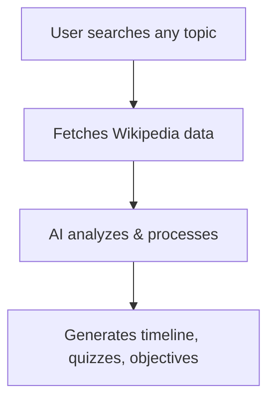

# 🕰️ EraExplorer - AI-Powered Historical Learning Platform

> **A revolutionary educational platform that transforms ANY historical search into a comprehensive, interactive learning adventure — powered by real-time AI and Wikipedia.**

<p align="center">
  <a href="#-revolutionary-ai-learning-system"></a>
  <a href="#-example-learning-journeys"></a>
  <a href="#-technical-architecture"></a>
  <a href="#-getting-started"></a>
  <a href="#-user-guide"></a>
  <a href="#-educational-benefits"></a>
  <a href="#-contributing"></a>
</p>

---

## 🚀 <span id="revolutionary-ai-learning-system"></span>**REVOLUTIONARY AI LEARNING SYSTEM**

### 🧠  Universal AI Content Generation
-  Type any topic — get instant learning content
-  Comprehensive timelines, quizzes, materials in seconds
-  Live access to millions of historical articles
-  AI processes Wikipedia for educational value
-  No manual content curation needed
-  Automatic topic classification & difficulty detection

### 🔍  Advanced Search & Discovery
-  Instant ⌘K (or Ctrl+K) search
-  Dynamic suggestions as you type
-  Discover what others are learning
-  AI-categorized results: events, people, places, more
-  Revisit your learning journey
-  AI-powered result ranking

### 📚  Complete Learning Experience
-  Explore any period with smooth animations
-  Smart questions & explanations for any topic
-  Clear goals for every search
-  Analytics, achievements & streaks
-  Monitor your journey & goals
-  Real-time understanding evaluation

---

## 🎯 **HOW THE AI SYSTEM WORKS**

### 1️⃣ Universal Search


### 2️⃣ AI Content Generation
- **Timeline Creation:** Extracts key dates and events
- **Quiz Generation:** Creates relevant questions with explanations
- **Learning Objectives:** Identifies goals based on complexity
- **Difficulty Assessment:** Sets appropriate user level
- **Key Facts Extraction:** Highlights must-know info

### 3️⃣ Real-time Learning
- **Instant Results:** No waiting, immediate content
- **Adaptive Content:** Matches topic and user level
- **Comprehensive Coverage:** Ancient to modern history
- **Quality Assurance:** Fallbacks for uninterrupted learning

---

## 🌟 <span id="example-learning-journeys"></span>**EXAMPLE LEARNING JOURNEYS**

<div align="center">

|  |  |  |
|:---:|:---:|:---:|
| Interactive timeline (2000 BC–1500 AD)<br>Quiz: achievements, calendar, decline<br>Goals: culture, architecture, astronomy<br>Key facts: writing, cities, innovations | Timeline: 1760–1840, major innovations<br>Quiz: steam engine, factories, social change<br>Goals: technology & society<br>Key facts: inventors, conditions, global impact | Timeline: reign & major events<br>Quiz: Rome, achievements<br>Goals: Egypt, ancient politics<br>Key facts: intellect, languages, legacy |

</div>

---

## 🛠️ <span id="technical-architecture"></span>**TECHNICAL ARCHITECTURE**

### 🧩 AI Content Generation Engine
```typescript
// Real-time content generation
const { event, success } = await contentGenerator.generateHistoricalEvent(searchQuery);
// Wikipedia API, NLP, timeline extraction, quiz logic, caching, and more
```

### ⚡ Smart Search System
```typescript
// Advanced search + AI categorization
const results = await wikipediaAPI.searchArticles(query, 15);
const categorized = results.map(result => ({
  ...result,
  type: AI.categorize(result),
  relevance: AI.calculateRelevance(result, query),
  difficulty: AI.assessDifficulty(result)
}));
```

### 🚀 Performance Optimizations
- 
- 
- 
- 
- 

---

## 🚀 <span id="getting-started"></span>**GETTING STARTED**

### **Prerequisites**
- 
- 
- 

### **Quick Start**
```bash
git clone https://github.com/yourusername/eraexplorer.git
cd eraexplorer
npm install
npm run dev
```

### **Production Build**
```bash
npm run build
npm run preview
```

---

## 📖 <span id="user-guide"></span>**USER GUIDE**

### 
1.  Press ⌘K (Ctrl+K) or click search <br>
2.  Enter any topic, person, or event <br>
3.  Click <b>Start Learning</b> for instant AI content <br>
4.  Browse Wikipedia or trending topics

### 
- Interactive Timeline, Knowledge Quiz, Learning Objectives, Progress Tracking

### 
- Daily Goals, Achievements, Calendar, Knowledge Level

---

## 🎓 <span id="educational-benefits"></span>**EDUCATIONAL BENEFITS**

|  |  |  |
|:---:|:---:|:---:|
| Unlimited topics, Adaptive learning, Instant feedback, Interactive visuals, Progress motivation | Infinite teaching materials, Real-time resources, Built-in quizzes, Curriculum support, Engagement tools | Millions of topics, Primary sources, Trend analysis, Quick overviews |

---

## 🔧 **API INTEGRATIONS**

### 
```typescript
// Real-time summaries, search, trending
const summary = await wikipediaAPI.getArticleSummary(title);
const results = await wikipediaAPI.searchArticles(query, limit);
const trending = await wikipediaAPI.getTrendingTopics();
```

### 
```typescript
// AI-powered content
const content = await contentGenerator.generateHistoricalEvent(query);
// Timelines, quizzes, objectives, facts, difficulty
```

---

## 🎨 **DESIGN PHILOSOPHY**

- 
- 
- 
- 

---

## 🚀 **PRODUCTION FEATURES**

|  |  |  |
|:---:|:---:|:---:|
| Caching, error recovery, memory efficiency | Works for any subject, always current, global, multi-language | Robust error handling, offline use, cross-browser |

---

## 🔮 **FUTURE ENHANCEMENTS**

- Personalized-Learning-Paths
- 
- 
- 
- Primary sources, expert annotations, VR, maps, mobile, offline, API, and more!

---

## 🤝 <span id="contributing"></span>**CONTRIBUTING**

<p align="center">
  <a href="https://github.com/yourusername/eraexplorer/fork">
    
  </a>
  <a href="https://github.com/yourusername/eraexplorer/issues">
    
  </a>
  <a href="https://github.com/yourusername/eraexplorer/pulls">
    
  </a>
</p>

**How to contribute:**
1. 
2. 
3. 
4. 
5. 

**Areas:**  


---

## 📊 **PLATFORM STATISTICS**

|  |  |  |  |
|:---:|:---:|:---:|:---:|

- AI-Generated Timelines, Smart Quizzes, Adaptive Content, Progress Tracking

---

## 🙏 **ACKNOWLEDGMENTS**


---

## 🌟 **KEY FEATURES SUMMARY**


---

## 🎯 **THE REVOLUTION IN HISTORICAL EDUCATION**

EraExplorer represents a paradigm shift in educational technology. By combining AI content generation with real-time Wikipedia integration, we've created the world's first truly scalable historical learning platform.

> 
> 
> 

Just pure, unlimited learning potential for any historical topic imaginable.

---

<p align="center"><b>Made with ❤️ for the future of education and the democratization of historical knowledge.</b></p>
<p align="center"><i>EraExplorer — Where ANY historical curiosity becomes an instant learning adventure.</i></p>
<p align="center"></p>

## 👤 Author

* Aryan Kashyap
* aryankashyap7899@gmail.com
* [My Github Profile](https://github.com/Void604)
